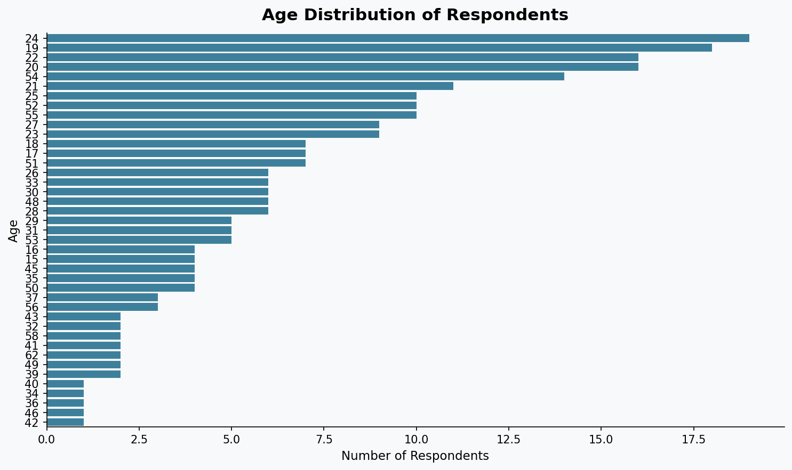
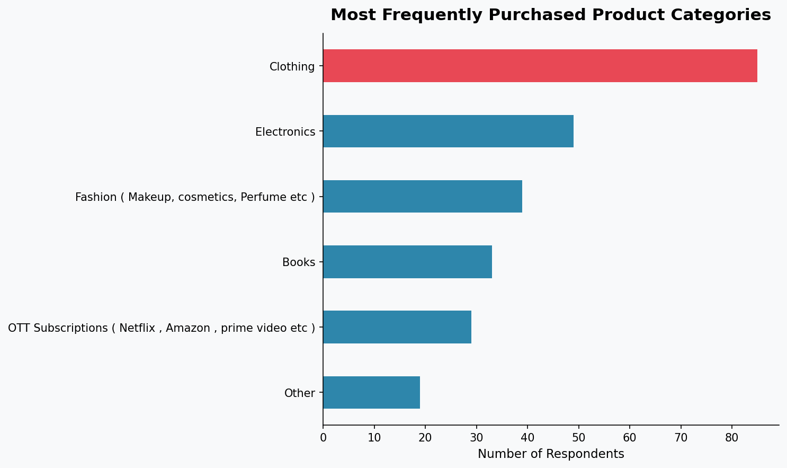
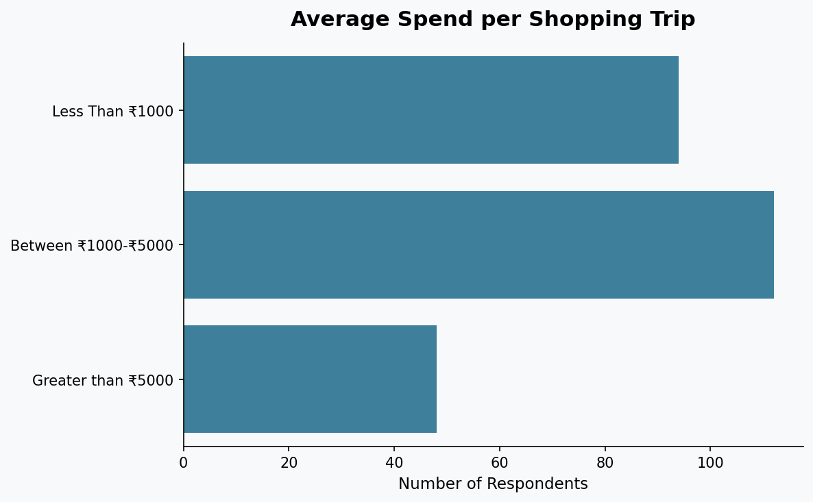
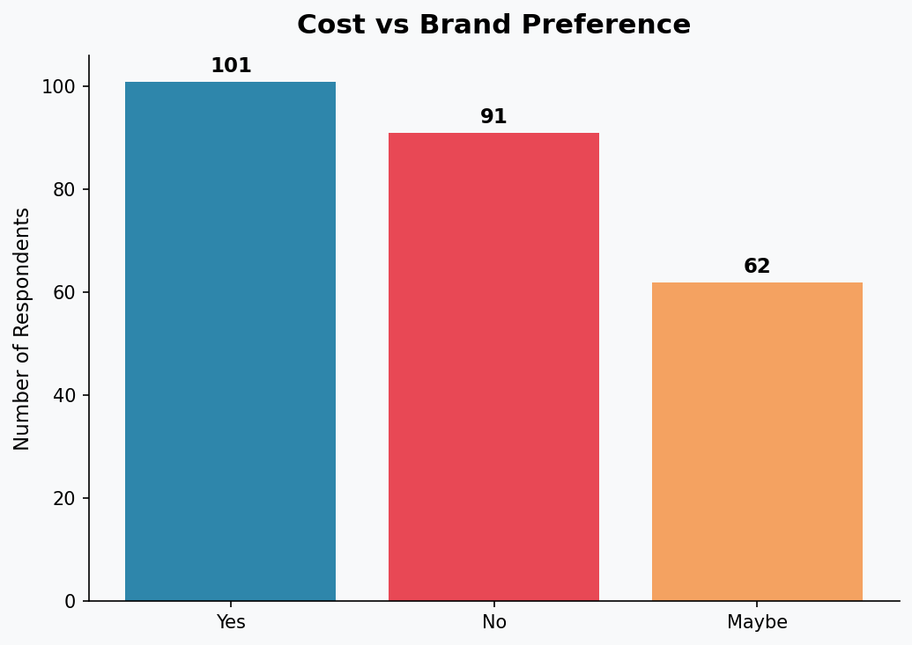
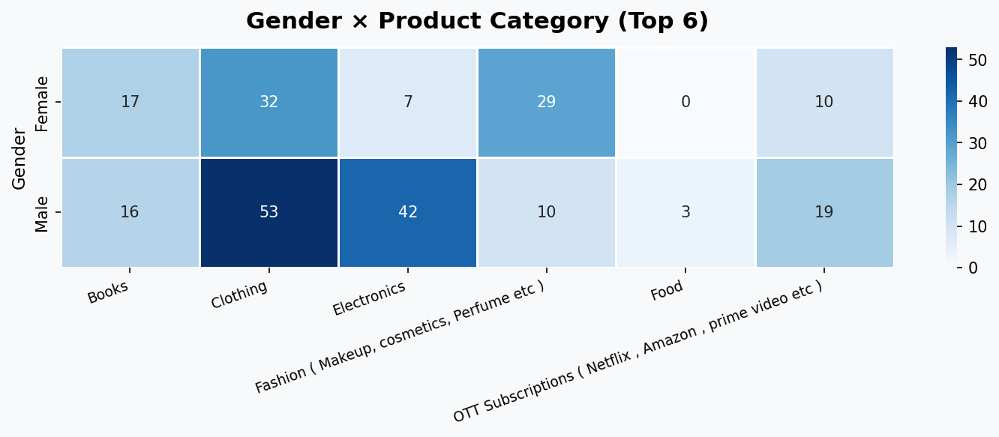
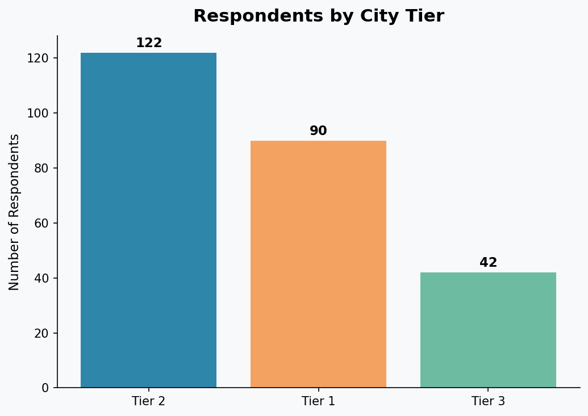

# 🛒 Decoding the Indian Shopper: An Exploratory Data Analysis of Customer Buying Behaviour


---

## 📋 Executive Summary

| | |
|---|---|
| **Business Problem** : Retailers and e-commerce platforms lack insight into what drives Indian consumers to choose products, whether it is brand loyalty, price sensitivity, category preference, or demographic background. Without this, marketing spend is misdirected and conversion rates suffer. |
| **Solution** : Performed a full Exploratory Data Analysis (EDA) on a 254-respondent survey to surface patterns in demographics, spending, category preferences, and brand vs cost decision-making. |
| **Key Impact** : 48% of respondents are from Tier 2 cities — an underserved, high-growth market. 40% of shoppers prefer cost over brand, rising to 51% among students. Clothing and Electronics together account for over 50% of frequent purchases. |
| **Next Steps** : Extend with ML-based customer segmentation; gather larger, longitudinal data for trend analysis. |

---

## 🧩 Business Problem

Indian e-commerce is growing at over 20% annually, yet most marketing strategies are built on assumptions rather than data. Key unanswered questions include:

- **Who** is doing the shopping — age, gender, city, financial background?
- **What** are they buying most frequently?
- **How much** are they willing to spend?
- **Why** do they choose a product — brand trust or price?

Understanding these questions helps:
- E-commerce platforms **personalise recommendations** more effectively
- Brands **allocate marketing budgets** toward the right demographic
- Retailers **stock and price products** to match buyer intent
- Startups identify **untapped markets** (e.g. Tier 2 and Tier 3 cities)

---

## 🔬 Methodology

This project follows a structured EDA pipeline:

```
Raw Survey Data  →  Data Cleaning  →  Univariate Analysis  →  Bivariate Analysis  →  Insights & Recommendations
```

**Steps performed:**
1. Loaded and inspected the dataset (shape, dtypes, missing values)
2. Removed 2 duplicate rows
3. Cleaned the `Age` column — extracted digits from entries like `"55 years"` and dropped one invalid name entry (`"Anurag Dubey"`)
4. Parsed `Timestamp` to datetime
5. Plotted distributions for all key demographic and behavioural variables
6. Cross-analysed Gender × Product Category and Financial Status × Spend

---

## 🛠️ Tools & Skills

| Category | Detail |
|---|---|
| **Language** | Python 3 |
| **Data Manipulation** | Pandas, NumPy |
| **Visualisation** | Matplotlib, Seaborn |
| **Environment** | Jupyter Notebook |
| **Data Cleaning** | Regex extraction, dtype coercion, deduplication, null handling |
| **Analysis Types** | Univariate distributions, bivariate crosstabs, heatmaps, boxplots |
| **Version Control** | Git, GitHub |

---

## 📊 Results & Visual Insights

### 1. Who Are the Shoppers? — Age Distribution



> **Insight:** The largest group of respondents falls between ages **19–25**, reflecting a young, digitally active audience. The secondary cluster at **51–55** suggests a growing older demographic entering online shopping.

---

### 2. What Are They Buying? — Product Category



> **Insight:** **Clothing** is the most purchased category (85 respondents), followed by **Electronics** (49) and **Fashion/Cosmetics** (39). Together, Clothing + Electronics account for **52% of all frequent purchases**.

---

### 3. How Much Are They Spending? — Spend per Trip



> **Insight:** **44%** of shoppers spend between ₹1,000–₹5,000 per trip, making this the dominant spend bracket. Only **19%** spend above ₹5,000, suggesting a largely mid-range market. Businesses should anchor pricing and bundling strategies within the ₹1,000–₹5,000 range.

---

### 4. Brand Loyalty vs Price Sensitivity



> **Insight:** When given a choice between a cheaper unknown product and a branded one, **40% said Yes to cost**, 36% said No (brand loyal), and 24% were undecided. Among **students specifically**, 51% chose cost over brand — a critical finding for budget-positioned brands and private labels.

---

### 5. Who Buys What? — Gender × Category Heatmap



> **Insight:** Males dominate **Electronics** and **OTT Subscriptions**, while Females lean toward **Clothing** and **Fashion/Cosmetics**. Both genders buy **Books** equally. This validates gender-targeted marketing for category-specific campaigns.

---

### 6. Where Are They From? — City Tier



> **Insight:** **48% of respondents are from Tier 2 cities** — the single largest group — overtaking Tier 1 (35%). This signals that Tier 2 markets are not secondary; they are the core audience and should be treated as the primary growth target.

---

## 💼 Business Recommendations

| # | Recommendation | Stakeholder | Expected Benefit |
|---|---|---|---|
| 1 | **Target Tier 2 cities aggressively.** 48% of respondents are from Tier 2 — launch localised campaigns, regional language support, and Tier 2-specific delivery offers | Marketing & Growth Teams | Capture underserved high-growth market |
| 2 | **Lead with price for the 18–25 segment.** Over 50% of students prefer cost over brand. Offer EMI options, student discounts, or private labels in this bracket | Pricing & Product Teams | Higher conversion rate among largest age group |
| 3 | **Double down on Clothing and Electronics.** These two categories alone drive 52% of purchase frequency — prioritise inventory, UX personalisation, and ad spend here | Category & Inventory Teams | Maximise ROI on marketing spend |
| 4 | **Design gender-segmented campaigns.** Males respond to Electronics/OTT promotions; Females to Clothing/Fashion. Use this split in email, social, and retargeting | Digital Marketing Teams | Improved click-through and relevance scores |
| 5 | **Optimise for the ₹1,000–₹5,000 price band.** This is the sweet spot for 44% of shoppers. Bundle products or run offers within this range rather than deep discounting | Sales & Merchandising Teams | Higher average order value with lower discount burden |
| 6 | **Reduce decision friction for quick buyers.** 44% of shoppers decide within a day. Invest in better product pages, review systems, and one-click checkout to convert these fast deciders | UX & Product Teams | Reduced cart abandonment |

---

## ⚠️ Limitations & Next Steps

### Limitations
- **Small sample size (254):** Findings are directionally useful but not statistically representative of all Indian shoppers
- **Self-reported data:** Survey responses on spend and frequency may not match actual purchase behaviour
- **Convenience sample:** The respondent pool skews young and urban; rural and older demographics are underrepresented
- **One-time snapshot:** No time dimension — cannot detect seasonal trends or behaviour change over time
- **Open-ended fields:** Some columns (Product Category, Age) had free-text entries causing inconsistencies that required cleaning

### If I Had More Time / Data
- [ ] **Customer Segmentation** using K-Means clustering to group buyers by demographic + behaviour profile
- [ ] **Predictive modelling** — predict spend bracket from age, gender, and category
- [ ] **Larger, stratified sample** across all Indian states and age groups for generalizable insights
- [ ] **Longitudinal survey** — track the same respondents across quarters to observe behaviour shifts
- [ ] **Sentiment analysis** on open-text fields for richer qualitative insight

---

## 📁 Repository Structure

```
customer-behaviour-eda/
│
├── Customer_Behaviour_EDA.ipynb       # Full Jupyter notebook with code + outputs
├── Customer_Behaviour_Survey_responses.csv   # Raw survey dataset
├── charts/                            # Exported visualisation images
│   ├── age_distribution.png
│   ├── product_category.png
│   ├── spend_distribution.png
│   ├── brand_vs_cost.png
│   ├── gender_category_heatmap.png
│   └── city_tier.png
└── README.md                          # This file
```

---

## 👤 Author

**[Navjot Singh]**  
Aspiring Data Analyst | Python • SQL • EDA  
[LinkedIn](https://www.linkedin.com/in/-navjotsingh) • [GitHub](https://github.com/Nav2234)

---

*Dataset collected via Google Forms survey and Kaggle. Analysis performed for portfolio and learning purposes.*
